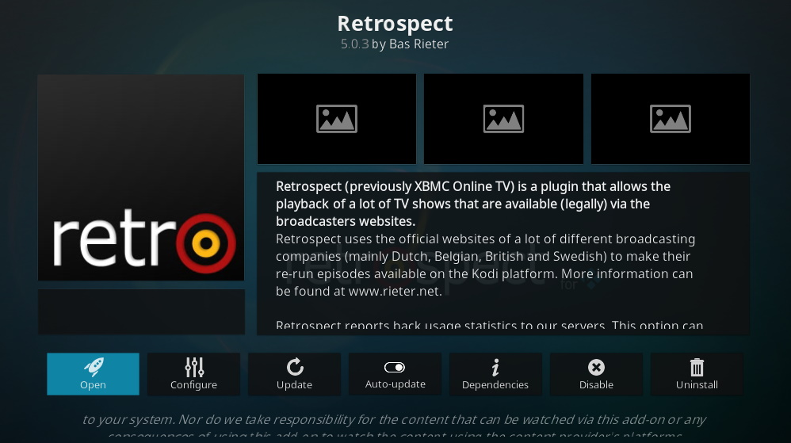

# Retrospect - Public GIT Repository #

This repository holds the main code for Retrospect. For more information on bug reporting please visit https://github.com/retrospect-addon/plugin.video.retrospect or https://www.rieter.net/content/.

# Installing Retrospect #
There are two ways to install Retrospect, depending on what version of Kodi you are using:

### Kodi Leia and later
Starting from Kodi Leia (v18), you can easily install Retrospect from the official Kodi add-on repository. Simply search for Retrospect in the add-ons section and install it. More detailed information can be found in the [Retrospect Wiki](https://github.com/retrospect-addon/plugin.video.retrospect/wiki/Installation).

**Note:** Make sure that the _Auto-Update_ option for Retrospect is enabled to automagically receive new updates.

### Kodi Krypton    
If you are running Kodi Krypton (v17) the only way to install Retrospect is to install it from a zip file. Follow these steps (keep in mind they might slightly differ depending on your skin):

1. Download the latest Retrospect zip file from here: [https://github.com/retrospect-addon/plugin.video.retrospect/releases](https://github.com/retrospect-addon/plugin.video.retrospect/releases)
1. Transfer the file to you Kodi system (_optional_)
1. Install Retrospect from zip file

More detailed information can be found in the [Retrospect Wiki](https://github.com/retrospect-addon/plugin.video.retrospect/wiki/Installation).

**Note:** Since Retrospect isn't available in the official Kodi add-on repository for Kodi 17 Krypton, it will not automagically update. Retrospect will notifiy you of new versions. You will then have to manually update your Retrospect add-on using the steps above.

# Troubleshooting #

### Playing Widevine DRM content ###
Starting from Kodi Leia (v18) the playback of DRM protected streams is supported using the `InputStream Adaptive` add-on. Kodi comes with this pre-installed, but by default it is disabled. Make sure that you **enable** it first. In order to play Widevine DRM files you will need to have the Google Widevine libraries installed. Android based devices have this as a native component, for Windows and Linux you will need to install them:

The _Easy way_:

1. Open the Retrospect add-on settings.
1. Enable support for the InputStream Adaptive add-on by enabling `Use Kodi InputStream Adaptive add-on when possible`.
1. Select **OK** to save the settings.
1. Open the Retrospect add-on settings again.
1. Go to `Install Widevine using InputStream Adaptive Helper add-on`.
1. Complete the steps the InputStream Adaptive Helper add-on gives you.

The _Manual way_:

1. Determine the latest version of the Widevine libraries: [https://dl.google.com/widevine-cdm/versions.txt](https://dl.google.com/widevine-cdm/versions.txt)
1. Download the appropriate version for your OS/Kodi combination (replace the {version} with the most recent version):
    * 32-bit kodi on Windows: [https://dl.google.com/widevine-cdm/{version}-win-ia32.zip](https://dl.google.com/widevine-cdm/{version}-win-ia32.zip)
    * 64-bit kodi on Windows: [https://dl.google.com/widevine-cdm/{version}-win-x64.zip](https://dl.google.com/widevine-cdm/{version}-win-x64.zip)
    * 32-bit kodi on Linux: [https://dl.google.com/widevine-cdm/{version}-linux-ia32.zip](https://dl.google.com/widevine-cdm/{version}-linux-ia32.zip)
    * 32-bit kodi on Linux: [https://dl.google.com/widevine-cdm/{version}-linux-x64.zip](https://dl.google.com/widevine-cdm/{version}-linux-x64.zip)
1. For Windows, copy these files into your `<kodi-profile>\cdm` Linux users need to install them manually (or they can use this [gist](https://gist.github.com/ruario/3c873d43eb20553d5014bd4d29fe37f1) ([Fork](https://gist.github.com/basrieter/44a463a97a60958c36435d54d50debb4)) to install it automatically).

_Example:_
> If the most recent version obtained via https://dl.google.com/widevine-cdm/versions.txt is `4.10.1440.19`, then the download url for 64-bit windows is https://dl.google.com/widevine-cdm/4.10.1440.19-win-x64.zip.

The kodi.log will tell you if you did not put them in the correct place or if you have copied the wrong version.

_NOTE: for Kodi Krypton it seems that version 1.4.8.1008 is the last version that is compatible._

For **ARM Devices** (Such as a Raspberry Pi) things might be a bit different. If you are running Android, you probably don't need to do anything at all as Widevine is natively supported. However, if you are running Linux on ARM and the above method does not work, there is a different approach:

1. Determine the latest version of the libraries for ARM using this url: [https://dl.google.com/dl/edgedl/chromeos/recovery/recovery.conf](https://dl.google.com/dl/edgedl/chromeos/recovery/recovery.conf)
1. From that configuration file, find the image for an ARM device that resembles your device. 
    * Multiple successes have been reported using the the *Acer Chromebook R13* image.
    * The device configuration section in the config file have an `url` field that contains a link to a recovery image. 
    * In the case of the *Acer Chromebook R13* you can download the full recovery from this url: [https://dl.google.com/dl/edgedl/chromeos/recovery/chromeos_{version}_elm_recovery_stable-channel_mp.bin.zip](https://dl.google.com/dl/edgedl/chromeos/recovery/chromeos_11021.81.0_elm_recovery_stable-channel_mp.bin.zip).
1. From that recovery image you will need the Widevine files located in `/opt/google/chrome/libwidevinecdm*.so`.
1. These files need to be copied to the `<kodi-profile>/cdm` folder.

_NOTE: Keep in mind that you might need to try multiple recovery images before you find a working one._ 

# Copyrights and Licenses #

Retrospect is licensed under a _Creative Commons Attribution-NonCommercial-ShareAlike 4.0 International_. See also: [LICENSE.md](./LICENSE.md)

The official add-on package currently available within the official Kodi add-on repository may not be distributed via other channels than the official Kodi add-on repository. 

### Disclaimer ###
Retrospect or Rieter.net are not connected to or in any other way affiliated with Kodi, Team Kodi or the Kodi Foundation. Furthermore, any software, addons, or products offered by Retrospect or Rieter.net will receive no support in official Kodi channels, including the Kodi forums and various social networks.

### Rules & Terms ###
As more and more people are starting to make channels for Retrospect, we want to lay out some rules and terms for the channels that we will host on this site. Please stick to them before asking us to post or link to them on the site:

 1. We, the Retrospect team, are not responsible for any content that is displayed using Retrospect.
 1. We, the Retrospect team, do not support any kind of adult content for Retrospect, nor will we host it on our servers.
