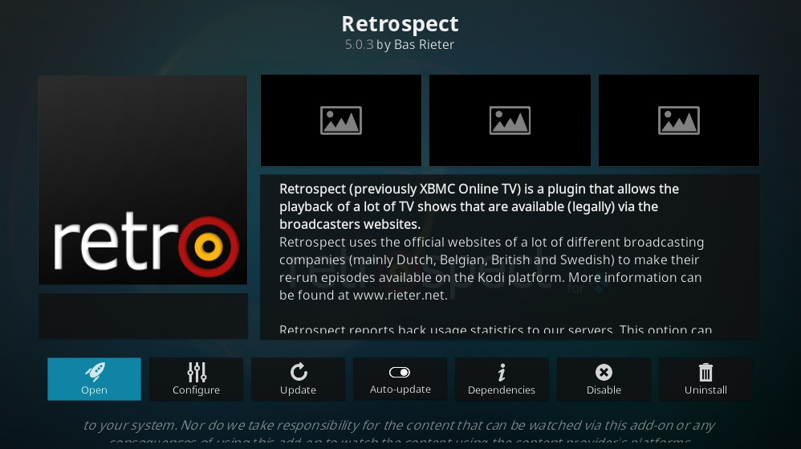

# Retrospect - Public GIT Repository #

This repository holds the main code for Retrospect. For more information of bug reporting please visit https://github.com/retrospect-addon/plugin.video.retrospect or https://www.rieter.net/content/.

# Installing Retrospect #
There are two ways to install Retrospect, depending on what version of Kodi you are using:

### Kodi Leia and later
Let's start with the most recent version of Kodi: Leia (18.0) and newer version such as Matrix (19.0). Users running these version of Kodi can easy install Retrospect via the Kodi repository. Follow these steps (keep in mind they might slightly differ depending on your skin):

1. Go to Add-ons
1. Add-on Browser
1. Install from repository
1. Video Add-ons
1. Find _Retrospect_ and select it
1. Hit _Install_ to install Retrospect
1. Agree to install any dependencies that are needed

Make sure to enable the _Auto-Update_ option for Retrospect to automatically receive new updates.

### Kodi Krypton    
If you are running Kodi Krypton the only way to install Retrospect is to install it from a release zip file. This is because Retrospect is not in the Kodi repository for Krypton. Follow these steps (keep in mind they might slightly differ depending on your skin):

1. Download the latest release zip file from here: [https://github.com/retrospect-addon/plugin.video.retrospect/releases](https://github.com/retrospect-addon/plugin.video.retrospect/releases)
1. Open Kodi
1. Go to Add-ons
1. Add-on Browser
1. Install from zip file
1. Browse to the zip file you downloaded and install Retrospect
1. Agree to install any dependencies that are needed

Keep in mind, that because Retrospect is not in the Kodi repository it will not automagically update. Retrospect will notifiy you of new versions. You will then have to manually update you Retrospect add-on with the steps aboven.

# Troubleshooting #

### Playing Widevine DRM content ###
Starting with Kodi Leia (Kodi 18) the playback of DRM protected streams is supported using the `input.adaptive` add-on. Kodi comes with this pre-installed, but by default it is disabled. So make sure that you **enable** it first. In order to play Widevine DRM files you will need to have the Google Widevine libraries installed. Android based devices have this as a native component, for Windows and Linux you will need to install them:

The _Easy way_:

1. Open the Retrospect add-on settings.
1. Enable support for the InputStream Adaptive add-on within Retrospect by enabling `Use Kodi InputStream Adaptive add-on when possible`.
1. Select **OK** to save the settings.
1. Open the Retrospect add-on settings again.
1. Go to `Install Widevine using InputStream Adaptive Helper add-on` en select this option.
1. Complete the steps that the InputStream Adaptive Helper add-on give you.

The _Manual way_:

1. Determine the last version of the Widevine libraries: [https://dl.google.com/widevine-cdm/versions.txt](https://dl.google.com/widevine-cdm/versions.txt)
1. Download the appropriate version for your OS/Kodi combination (replace the {version} with the most recent version):
    * 32-bit kodi on Windows: [https://dl.google.com/widevine-cdm/{version}-win-ia32.zip](https://dl.google.com/widevine-cdm/{version}-win-ia32.zip)
    * 64-bit kodi on Windows: [https://dl.google.com/widevine-cdm/{version}-win-x64.zip](https://dl.google.com/widevine-cdm/{version}-win-x64.zip)
    * 32-bit kodi on Linux: [https://dl.google.com/widevine-cdm/{version}-linux-ia32.zip](https://dl.google.com/widevine-cdm/{version}-linux-ia32.zip)
    * 32-bit kodi on Linux: [https://dl.google.com/widevine-cdm/{version}-linux-x64.zip](https://dl.google.com/widevine-cdm/{version}-linux-x64.zip)
1. For Windows installation copy these files into your `<kodi-profile>\cdm` folder. Linux users need to install them manually (or they can use this [gist](https://gist.github.com/ruario/3c873d43eb20553d5014bd4d29fe37f1) ([Fork](https://gist.github.com/basrieter/44a463a97a60958c36435d54d50debb4)) to install it automatically).

_Example:_
> If the most recent version obtained via https://dl.google.com/widevine-cdm/versions.txt is `4.10.1440.19`, then the download url for 64-bit windows is https://dl.google.com/widevine-cdm/4.10.1440.19-win-x64.zip.

The kodi.log will tell you if you did not put them in the correct place or if you have copied the wrong version.

_NOTE: for Kodi Krypton it seems that version 1.4.8.1008 is the last version that is compatible._

For **ARM Devices** (Such as a Raspberry Pi) things might be a bit different. If you are running Android, you probably don't need to do anything at all and Widevine should work. However, if you are running Linux on ARM and the above method does not work, there is a different approach:

1. Determine the last version of the libraries for ARM using this url: [https://dl.google.com/dl/edgedl/chromeos/recovery/recovery.conf](https://dl.google.com/dl/edgedl/chromeos/recovery/recovery.conf)
1. From that configuration file, find the image for an ARM device that resembles your device. 
    * Multiple successes have been reported using the the *Acer Chromebook R13* image.
    * The device configuration section in the config file have an `url` field that contains a link to a recovery image. 
    * In the case of the *Acer Chromebook R13* you can download the full recovery from this url: [https://dl.google.com/dl/edgedl/chromeos/recovery/chromeos_{version}_elm_recovery_stable-channel_mp.bin.zip](https://dl.google.com/dl/edgedl/chromeos/recovery/chromeos_11021.81.0_elm_recovery_stable-channel_mp.bin.zip).
1. From that recovery image you will need the Widevine files located in `/opt/google/chrome/libwidevinecdm*.so`.
1. These files need to be copied to the `<kodi-profile>/cdm` folder.

_NOTE: Keep in mind that you might need to try multiple recovery images before you find a working one._ 

# Copyrights and Licenses #
*See also: http://www.rieter.net/content/xot/license/.*

### Retrospect (Dual) License ###
Retrospect Framework by Bas Rieter is licensed under a Creative Commons Attribution-Non-Commercial-No Derivative Works 3.0 Unported License. Files that belong to the Retrospect Framework have a disclaimer stating that they are licensed under the Creative Commons Attribution-Non-Commercial-No Derivative Works 3.0 Unported License.

All channels, skins and config.py (further called Retrospect Additions) are free software: you can redistribute it and/or modify it under the terms of the GNU General Public License version 3 as published by the Free Software Foundation. Retrospect Additions are distributed in the hope that it will be useful, but WITHOUT ANY WARRANTY; without even the implied warranty of MERCHANTABILITY or FITNESS FOR A PARTICULAR PURPOSE. See the GNU General Public License for more details. You should have received a copy of the GNU General Public License along with Retrospect Additions. If not, see [1]. Kodi Add-on packages containing modified code must be given a different add-on identification to prevent confusion with the official packages.
Distributing Retrospect

The official add-on packages that are currently available within the official Retrospect Repository may not be distributed via other channels than the official Retrospect Repository. Only the official Retrospect Respository (respository.retrospect) package itself may be distributed and/or included within other Kodi (super) repositories.

### Disclaimer ###
Retrospect or Rieter.net are not connected to or in any other way affiliated with Kodi, Team Kodi, or the Kodi Foundation. Furthermore, any software, addons, or products offered by Retrospect or Rieter.net will receive no support in official Kodi channels, including the Kodi forums and various social networks.

### Rules & Terms ###
As more and more people are starting to make channels for the Retrospect Framework, we want to lay out some rules and terms for the channels that we will host on this site. Please stick to them before asking us to post or link to them on the site:

 1. We, the Retrospect Framework team, are not responsible for any content that is displayed using the Retrospect Framework.
 1. We, the Retrospect Framework team, do not support any kind of Adult content for the Retrospect Framework nor will we host it on our servers.

